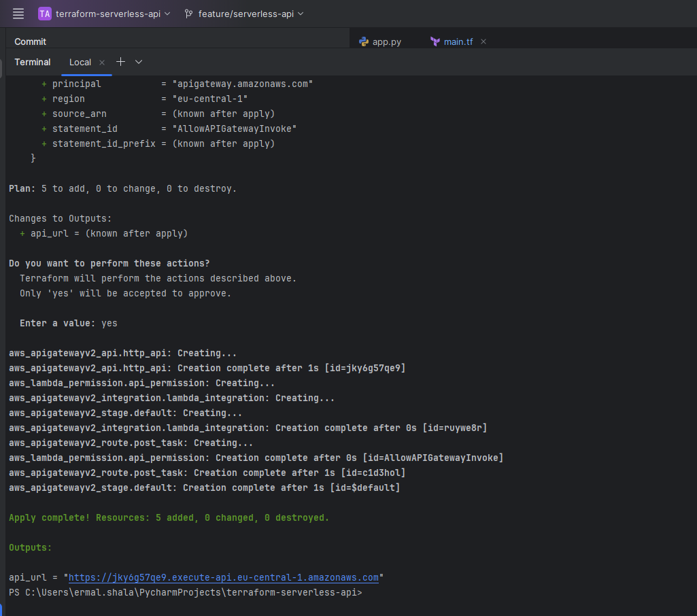
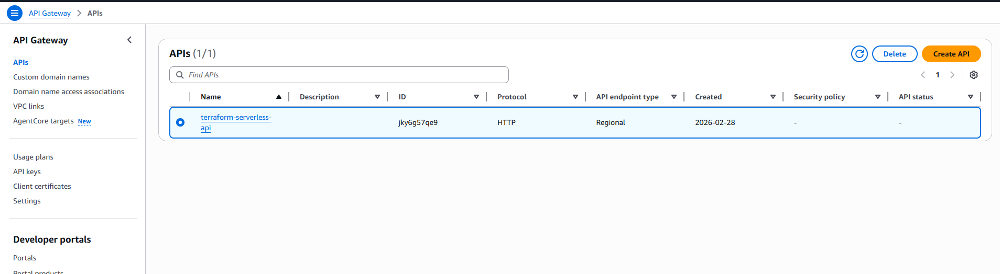
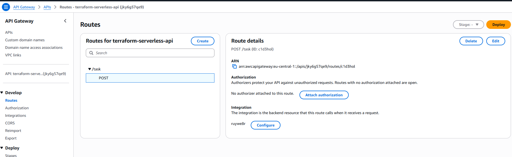
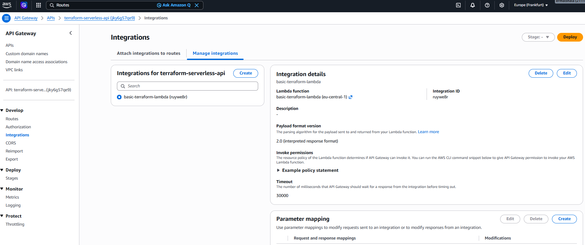
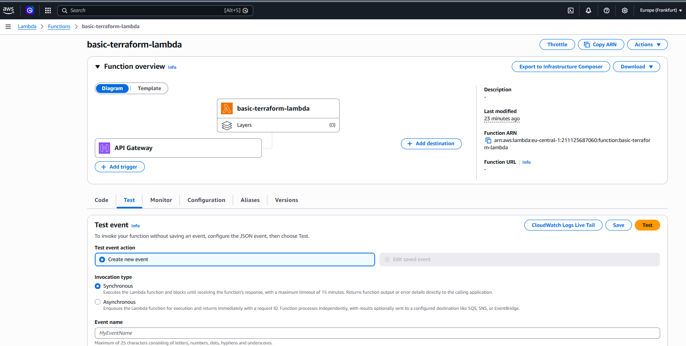
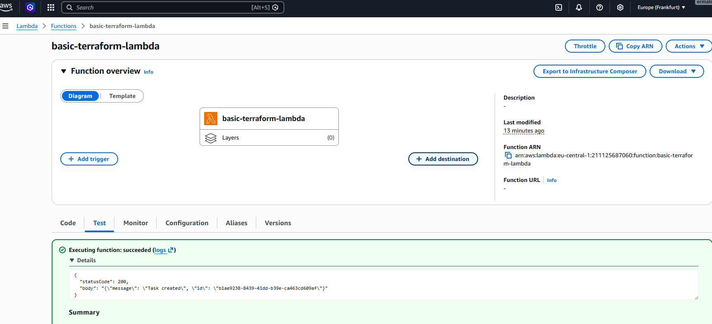
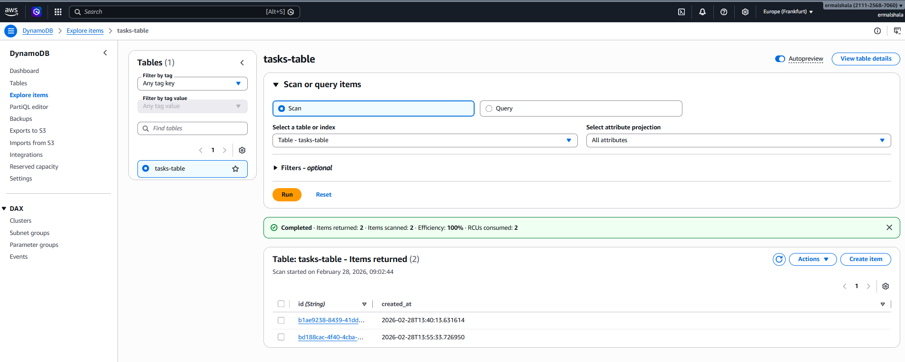
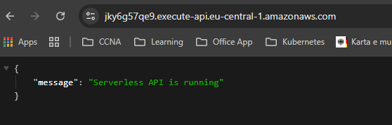
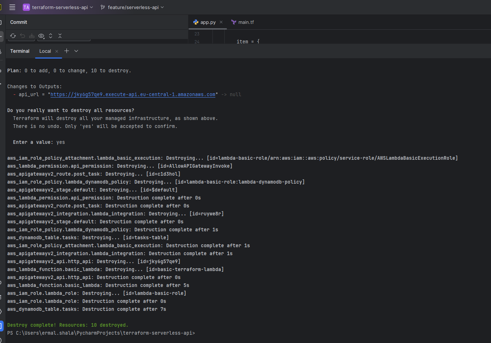

# Terraform Serverless API (AWS)

A fully serverless REST API deployed on AWS using Terraform (Infrastructure as Code).

---

## Overview

This project provisions a production-style serverless architecture using:

- AWS Lambda (Python 3.9)
- Amazon API Gateway (HTTP API v2)
- Amazon DynamoDB
- IAM roles with least-privilege access
- Fully managed via Terraform

Infrastructure lifecycle is fully automated:

provision → test → destroy

---

## Architecture

Client (Browser / HTTP Request)  
→ API Gateway (HTTP API)  
→ AWS Lambda (Python)  
→ DynamoDB (tasks-table)

This architecture is fully serverless:

- No EC2
- No servers
- No manual provisioning
- Fully managed infrastructure

---

## Tech Stack

- Terraform
- AWS Lambda (Python 3.9)
- Amazon API Gateway (HTTP API v2)
- Amazon DynamoDB
- AWS IAM
- REST API

---

## Infrastructure Provisioning

All AWS resources were created using Terraform.

### Commands Used

```bash
terraform init
terraform plan
terraform apply
```

---

### Cleanup

To remove all AWS resources:

```bash
terraform destroy
```

---

## API Endpoints

### Health Check

```
GET /
```

Response:

```json
{
  "message": "Serverless API is running"
}
```

---

### Create Task

```
POST /task
```

Response:

```json
{
  "message": "Task created",
  "id": "generated-uuid"
}
```

---

## Screenshots

### Terraform Apply (Provisioning)



---

### API Gateway Overview



---

### API Routes



---

### API Integration (Lambda)



---

### Lambda Overview



---

### Lambda Test Success



---

### DynamoDB Items Stored



---

### Public API – Browser Access



---

### Terraform Destroy (Clean Teardown)



---

## What This Project Demonstrates

- Infrastructure as Code (Terraform)
- Fully serverless AWS architecture
- API Gateway + Lambda integration
- DynamoDB data persistence
- IAM least-privilege security model
- Automated infrastructure lifecycle (apply → destroy)

---

## Project Status

- Infrastructure provisioned successfully
- API fully operational
- Data persistence verified
- Infrastructure destroyed cleanly
